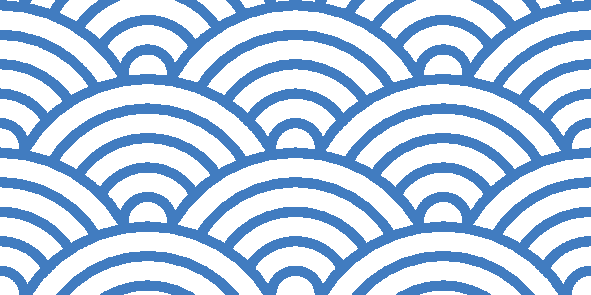
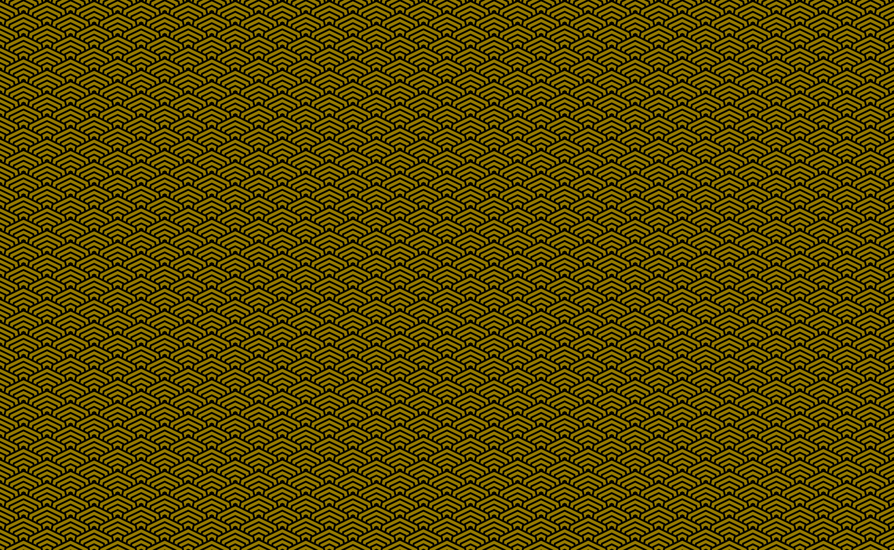
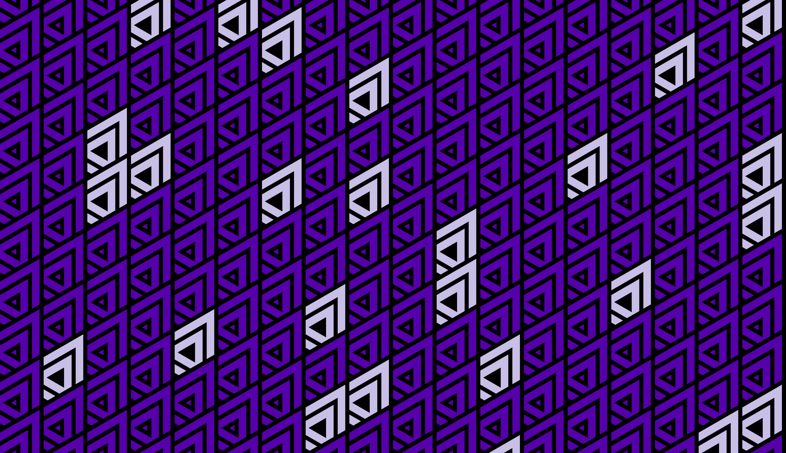
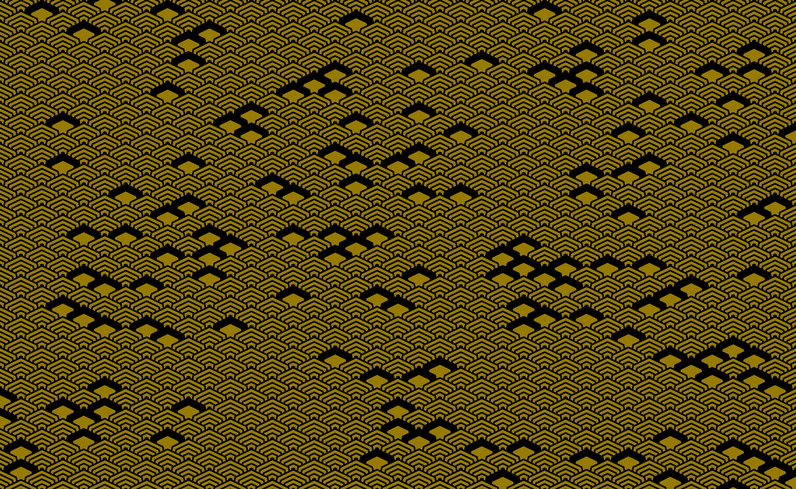
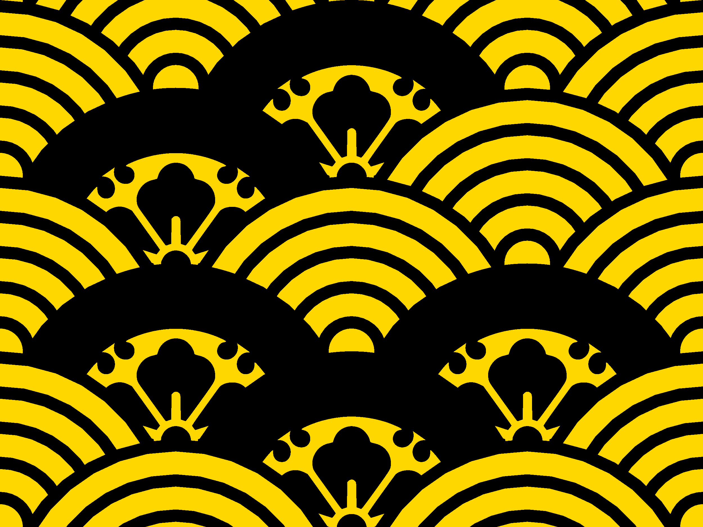

# Examples

## Usage

Add your files to the input directory of the mounted container.

```sh
docker run -it --rm \
  -u $(id -u):$(id -g) \
  -v ${PWD}/input:/app/input \
  -v ${PWD}/output:/app/output \
  ghcr.io/toshy/seigaiha:latest
```

* By default, it will find all files from the `/app/input` directory (recursively) and write the output to the `/app/output` directory. 
* Depending on the input options, either only a single polygon and/or a pattern will be created.

<div markdown="span" style="display: flex; justify-content: space-between;">
    <figure style="width: 100%; text-align: center;">
        { width="25%" height=50% }
        <figcaption style="margin-top: 5px;"><code>output/banner.png</code></figcaption>
    </figure>
    <figure style="width: 100%; text-align: center;">
        { width="100%" height=auto }
        <figcaption style="margin-top: 5px;"><code>output/banner_seigaiha.png</code></figcaption>
    </figure>
</div>

!!! question

    The image generated above uses the [`banner`](#banner) preset.

!!! note

    - By default, if no explicit `-e/--extension` argument is provided, both SVG and PNG output files will be created.
    - By default, output file names contain datetime in format `%d-%m-%Y_%H-%M-%S-%f`. You can disable this behavior by
      passing the `--no-unique-filename` argument.

### Specific file

Convert only a specific file and writing output to `/app/output` (default).

```sh
docker run -it --rm \
  -u $(id -u):$(id -g) \
  -v ${PWD}/input/custom.json:/app/input/custom.json \
  -v ${PWD}/output:/app/output \
  ghcr.io/toshy/seigaiha:latest \
  -i "input/custom.json" 
```

### Specific file with PNG extension only

Convert only a specific file and write the PNG output to `/app/output`.

```sh
docker run -it --rm \
  -u $(id -u):$(id -g) \
  -v ${PWD}/input/custom.json:/app/input/custom.json \
  -v ${PWD}/output:/app/output \
  ghcr.io/toshy/seigaiha:latest \
  -i "input/custom.json" \
  -e '["png"]'
```

!!! note

    The `-e/--extension` argument requires one of the following values: 

    - `'["svg", "png"]'` (default)
    - `'["svg"]'`
    - `'["png"]'`


### Single file with output subdirectory

Convert only a specific file and writing output to `/app/output/dir1`.

```sh
docker run -it --rm \
  -u $(id -u):$(id -g) \
  -v ${PWD}/input/custom.json:/app/input/custom.json \
  -v ${PWD}/output:/app/output \
  ghcr.io/toshy/seigaiha:latest \
  -i "input/custom.json" \
  -o "output/result"
```

### Specific subdirectory

Convert files in specific subdirectory and writing output to `/app/output/dir1`.

```sh
docker run -it --rm \
  -u $(id -u):$(id -g) \
  -v ${PWD}/input:/app/input \
  -v ${PWD}/output:/app/output \
  ghcr.io/toshy/seigaiha:latest \
  -i "input/dir1" \
  -o "output/dir1"
```

### Multiple inputs

Convert files in multiple input subdirectories and writing output to `/app/output` (default).

```sh
docker run -it --rm \
  -u $(id -u):$(id -g) \
  -v ${PWD}/input:/app/input \
  -v ${PWD}/output:/app/output \
  ghcr.io/toshy/seigaiha:latest \
  -i "input/dir1" \
  -i "input/dir2"
```

### Multiple inputs and outputs

Convert files in multiple input subdirectories and writing output to specific output subdirectories respectively.

```sh
docker run -it --rm \
  -u $(id -u):$(id -g) \
  -v ${PWD}/input:/app/input \
  -v ${PWD}/output:/app/output \
  ghcr.io/toshy/seigaiha:latest \
  -i "input/dir1" \
  -i "input/dir2" \
  -o "output/dir1" \
  -o "output/dir2"
```

## Presets

### Banner

???+ example "`input/banner.json`"

    Create blue-white Seigaiha modern polygon pattern. 

    ```json
    {
        "fractions": 11,
        "edges": 7,
        "spacing": 0.3,
        "rotation": 0,
        "pattern": {
            "horizontal": {
                "amount": 10,
                "spacing": 1
            },
            "vertical": {
                "amount": 20,
                "spacing": 0.25
            },
            "broken": {
                "factor": 0,
                "factor_rounding": "round",
                "fractions": 4,
                "skip_edge": true,
                "colours": [
                    {
                        "R": 0,
                        "G": 0,
                        "B": 0,
                        "A": 1
                    },
                    {
                        "R": 0,
                        "G": 0,
                        "B": 0,
                        "A": 1
                    },
                    {
                        "R": 0,
                        "G": 0,
                        "B": 0,
                        "A": 1
                    },
                    {
                        "R": 200,
                        "G": 191,
                        "B": 231,
                        "A": 1
                    }
                ],
                "images": []
            },
            "alternate": 1
        },
        "colours": [
            {
                "R": 65,
                "G": 124,
                "B": 192,
                "A": 1
            },
            {
                "R": 255,
                "G": 255,
                "B": 255,
                "A": 1
            }
        ],
        "output": {
            "resolution": 2500,
            "svg": {
                "preserveAspectRatio": "xMinYMin meet",
                "style": {
                    "shape-rendering": "crispEdges",
                    "transform-origin": "top left"
                }
            }
        }
    }
    ```

    <div markdown="span" style="display: flex; justify-content: space-between;">
        <figure style="width: 100%; text-align: center;">
            { width="75%" height=auto }
            <figcaption style="margin-top: 5px;"><code>output/banner_seigaiha.png</code></figcaption>
        </figure>
    </div>

### Repeatable pattern

???+ example "`input/basic.json`"

    The simplest repeatable patterns can be created by using the following pattern options:
    ```json
    "pattern": {
        "horizontal": {
            "amount": 3,
            "spacing": 1
        },
        "vertical": {
            "amount": 6,
            "spacing": 0.25
        },
        "alternate": 1
    }
    ```

    A complete preset example would like this:
    ```json
    {
        "fractions": 10,
        "edges": 36,
        "spacing": 0.3,
        "rotation": 0,
        "pattern": {
            "horizontal": {
                "amount": 3,
                "spacing": 1
            },
            "vertical": {
                "amount": 6,
                "spacing": 0.25
            },
            "alternate": 1
        },
        "colours": [
            {
                "R": 65,
                "G": 124,
                "B": 192,
                "A": 1
            },
            {
                "R": 255,
                "G": 255,
                "B": 255,
                "A": 1
            }
        ],
        "output": {
            "resolution": 2500,
            "svg": {
                "preserveAspectRatio": "xMinYMin meet",
                "style": {
                    "shape-rendering": "crispEdges",
                    "transform-origin": "top left"
                }
            }
        }
    }
    ```

    <div markdown="span" style="display: flex; justify-content: space-between;">
        <figure style="width: 100%; text-align: center;">
            { width="75%" height=auto }
            <figcaption style="margin-top: 5px;"><code>output/basic_seigaiha.png</code></figcaption>
        </figure>
    </div>

### Polygon edges

The `edges` option can be used to create polygon edges. It denotes the number of sides each polygon has.

???+ example "`input/4_edges.json`"

    This example shows a pattern where each polygon has 4 edges (squares) and is rotated by 90 degrees. Also, the `amount` options for the `horizontal` and `vertical` patterns are set to 10 and 25 respectively, creating a larger pattern.

    ```json
    {
        "fractions": 5,
        "edges": 4,
        "spacing": 0,
        "rotation": 90,
        "pattern": {
            "horizontal": {
                "amount": 10,
                "spacing": 1
            },
            "vertical": {
                "amount": 20,
                "spacing": 0.25
            },
            "alternate": 1
        },
        "colours": [
            {
                "R": 0,
                "G": 0,
                "B": 0,
                "A": 1
            },
            {
                "R": 2,
                "G": 94,
                "B": 133,
                "A": 1
            },
            {
                "R": 4,
                "G": 168,
                "B": 236,
                "A": 1
            },
            {
                "R": 154,
                "G": 207,
                "B": 244,
                "A": 1
            },
            {
                "R": 200,
                "G": 191,
                "B": 231,
                "A": 1
            }
        ],
        "output": {
            "resolution": 2500,
            "svg": {
                "preserveAspectRatio": "xMinYMin meet",
                "style": {
                    "shape-rendering": "crispEdges",
                    "transform-origin": "top left"
                }
            }
        }
    }
    ```

    <div markdown="span" style="display: flex; justify-content: space-between;">
        <figure style="width: 100%; text-align: center;">
            { width="75%" height=auto }
            <figcaption style="margin-top: 5px;"><code>output/4_edges_rotate_seigaiha.png</code></figcaption>
        </figure>
    </div>

???+ example "`input/7_edges.json`"

    This example shows a pattern where each polygon has 7 edges. Also, the `amount` options for the `horizontal` and `vertical` patterns are set to 20 and 50 respectively, creating a larger pattern.

    ```json
    {
        "fractions": 9,
        "edges": 7,
        "spacing": 0.25,
        "rotation": 0,
        "pattern": {
            "horizontal": {
                "amount": 20,
                "spacing": 1
            },
            "vertical": {
                "amount": 50,
                "spacing": 0.25
            },
            "broken": {
                "factor": 0.15,
                "factor_rounding": "floor",
                "fractions": 2,
                "colours": [
                    {
                        "R": 0,
                        "G": 0,
                        "B": 0,
                        "A": 1
                    },
                    {
                        "R": 150,
                        "G": 123,
                        "B": 0,
                        "A": 1
                    }
                ]
            },
            "alternate": 1
        },
        "colours": [
            {
                "R": 0,
                "G": 0,
                "B": 0,
                "A": 1
            },
            {
                "R": 150,
                "G": 123,
                "B": 0,
                "A": 1
            }
        ],
        "output": {
            "resolution": 2500,
            "mega_pixel_constraint": null,
            "svg": {
                "preserveAspectRatio": "xMinYMin meet",
                "style": {
                    "shape-rendering": "crispEdges",
                    "transform-origin": "top left"
                }
            }
        }
    }
    ```

    <div markdown="span" style="display: flex; justify-content: space-between;">
        <figure style="width: 100%; text-align: center;">
            { width="75%" height=auto }
            <figcaption style="margin-top: 5px;"><code>output/7_edges_seigaiha.png</code></figcaption>
        </figure>
    </div>

### Yabure Seigaiha

The "Yabure" Seigaiha pattern is a more complex pattern that uses the `broken` option to create a "broken" Seigaiha pattern.

???+ example "`input/yabure_seigaiha.json`"

    ```json
    {
        "fractions": 11,
        "edges": 36,
        "spacing": 0.3,
        "rotation": 0,
        "pattern": {
            "horizontal": {
                "amount": 10,
                "spacing": 1
            },
            "vertical": {
                "amount": 20,
                "spacing": 0.25
            },
            "broken": {
                "factor": 0.2, 
                "factor_rounding": "ceil",
                "fractions": 2,
                "skip_edge": true,
                "colours": [
                    {
                        "R": 0,
                        "G": 0,
                        "B": 0,
                        "A": 1
                    },
                    {
                        "R": 255,
                        "G": 215,
                        "B": 0,
                        "A": 1
                    }
                ],
                "images": []
            },
            "alternate": 1
        },
        "colours": [
            {
                "R": 0,
                "G": 0,
                "B": 0,
                "A": 1
            },
            {
                "R": 255,
                "G": 215,
                "B": 0,
                "A": 1
            }
        ],
        "output": {
            "resolution": 2500,
            "svg": {
                "preserveAspectRatio": "xMinYMin meet",
                "style": {
                    "shape-rendering": "crispEdges",
                    "transform-origin": "top left"
                }
            }
        }
    }
    ```

    <div markdown="span" style="display: flex; justify-content: space-between;">
        <figure style="width: 100%; text-align: center;">
            { width="75%" height=auto }
            <figcaption style="margin-top: 5px;"><code>output/yabure_seigaiha_plain_seigaiha.png</code></figcaption>
        </figure>
    </div>

???+ example "`input/3_edges_rotate_yabure.json`"

    ```json
    {
        "fractions": 5,
        "edges": 3,
        "spacing": 0.3,
        "rotation": 30,
        "pattern": {
            "horizontal": {
                "amount": 10,
                "spacing": 1
            },
            "vertical": {
                "amount": 20,
                "spacing": 0.25
            },
            "broken": {
                "factor": 0.15,
                "factor_rounding": "round",
                "fractions": 5,
                "colours": [
                    {
                        "R": 0,
                        "G": 0,
                        "B": 0,
                        "A": 1
                    },
                    {
                        "R": 200,
                        "G": 191,
                        "B": 231,
                        "A": 1
                    }
                ]
            },
            "alternate": 1
        },
        "colours": [
            {
                "R": 0,
                "G": 0,
                "B": 0,
                "A": 1
            },
            {
                "R": 85,
                "G": 0,
                "B": 170,
                "A": 1
            }
        ],
        "output": {
            "resolution": 2500,
            "svg": {
                "preserveAspectRatio": "xMinYMin meet",
                "style": {
                    "shape-rendering": "crispEdges",
                    "transform-origin": "top left"
                }
            }
        }
    }
    ```

    <div markdown="span" style="display: flex; justify-content: space-between;">
        <figure style="width: 100%; text-align: center;">
            { width="75%" height=auto }
            <figcaption style="margin-top: 5px;"><code>output/3_edges_rotate_yabure_seigaiha.png</code></figcaption>
        </figure>
    </div>

???+ example "`input/7_edges_yabure.json`"

    Similar to preset `input/7_edges.json` but with broken polygons.

    ```json
    {
        "fractions": 9,
        "edges": 7,
        "spacing": 0.25,
        "rotation": 0,
        "pattern": {
            "horizontal": {
                "amount": 20,
                "spacing": 1
            },
            "vertical": {
                "amount": 50,
                "spacing": 0.25
            },
            "broken": {
                "factor": 0.15,
                "factor_rounding": "floor",
                "fractions": 2,
                "colours": [
                    {
                        "R": 0,
                        "G": 0,
                        "B": 0,
                        "A": 1
                    },
                    {
                        "R": 150,
                        "G": 123,
                        "B": 0,
                        "A": 1
                    }
                ]
            },
            "alternate": 1
        },
        "colours": [
            {
                "R": 0,
                "G": 0,
                "B": 0,
                "A": 1
            },
            {
                "R": 150,
                "G": 123,
                "B": 0,
                "A": 1
            }
        ],
        "output": {
            "resolution": 2500,
            "svg": {
                "preserveAspectRatio": "xMinYMin meet",
                "style": {
                    "shape-rendering": "crispEdges",
                    "transform-origin": "top left"
                }
            }
        }
    }
    ```

    <div markdown="span" style="display: flex; justify-content: space-between;">
        <figure style="width: 100%; text-align: center;">
            { width="75%" height=auto }
            <figcaption style="margin-top: 5px;"><code>output/7_edges_yabure_seigaiha.png</code></figcaption>
        </figure>
    </div>


???+ example "`input/yabure_image.json`"

    It is also possible to fill in the broken parts of the pattern with an image, for which you can use the `images` option (under `broken`) to do so. This option requires atleast one base64 encoded SVG image.

    ```json
    {
        "fractions": 11,
        "edges": 36,
        "spacing": 0.3,
        "rotation": 0,
        "pattern": {
            "horizontal": {
                "amount": 10,
                "spacing": 1
            },
            "vertical": {
                "amount": 20,
                "spacing": 0.25
            },
            "broken": {
                "factor": 0.2, 
                "factor_rounding": "ceil",
                "fractions": 2,
                "skip_edge": true,
                "colours": [
                    {
                        "R": 0,
                        "G": 0,
                        "B": 0,
                        "A": 1
                    },
                    {
                        "R": 255,
                        "G": 215,
                        "B": 0,
                        "A": 1
                    }
                ],
                "images": [
                    ""
                ]
            },
            "alternate": 1
        },
        "colours": [
            {
                "R": 0,
                "G": 0,
                "B": 0,
                "A": 1
            },
            {
                "R": 255,
                "G": 215,
                "B": 0,
                "A": 1
            }
        ],
        "output": {
            "resolution": 2500,
            "svg": {
                "preserveAspectRatio": "xMinYMin meet",
                "style": {
                    "shape-rendering": "crispEdges",
                    "transform-origin": "top left"
                }
            }
        }
    }
    ```

    <div markdown="span" style="display: flex; justify-content: space-between;">
        <figure style="width: 100%; text-align: center;">
            { width="75%" height=auto }
            <figcaption style="margin-top: 5px;"><code>output/yabure_image_seigaiha.png</code></figcaption>
        </figure>
    </div>

    !!!tip

        * You can use the created single SVG polygon file to create a compatible SVG for your Yabure Seigaiha pattern.
        * Use `base64 vector-image.svg` to get base64 string, or write to temporary file with `cat vector-image.svg | base64 -w 0 > vector-image_base64.txt` and copy-paste the contents into the `images` key in the JSON preset.
        * You can use [https://jakearchibald.github.io/svgomg/](https://jakearchibald.github.io/svgomg/) to simplify predefined SVGs, making them more likely to work when creating a broken pattern with substituted images.


### Options

???+ example "`input/custom.json`"

    You can fully customise the settings to your liking.

    - `seed` - `int` - The seed for the [pseudo-random numbers generator](https://docs.python.org/3/library/random.html). If not set defaults to `None` which uses the current time as the seed.
    - `fractions` - `int` - The number of fractions of the polygon (including outer side of polygon).
    - `edges` - `int` - The number of sides of the polygon.
    - `spacing` - `float`|`int` - A factor for spacing between the fractions inside the polygon. 0 denotes equal distance between alternating fractions.
    - `rotation` - `float`|`int` - The rotation of the polygon in degrees.
    - `pattern` - `dict`|`bool` - Settings for the Seigaiha pattern.
        - `horizontal` - `dict` - Settings for the horizontal pattern.
            - `amount` - `int` - The number of horizontal polygons.
            - `spacing` - `float`|`int` - A factor for spacing between the horizontal polygons.
        - `vertical` - `dict` - Settings for the vertical pattern.
            - `amount` - `int` - The number of vertical polygons.
            - `spacing` - `float`|`int` - A factor for spacing between the vertical polygons.
        - `broken` - `dict` - Settings for the broken pattern.  
            - `factor` - `float`|`int` - The factor denoting how many polygons should be broken in the entire pattern.
            - `factor_rounding` - `str` - The rounding method for the `factor`. Options: `ceil`, `floor`, `round`. This options rounds the amount of broken polygons for the pattern.
            - `fractions` - `int` - The number of fractions of the polygon (including outer side of polygon).
            - `skip_edge` - `bool` - Denotes if broken polygons should be skipped on the edge of the pattern.
            - `colours` - `list` - A list of dictonaries of RGB(A) colours to use.
            - `images` - `list` - A list of base64 strings of SVG images to use.
        - `alternate` - `int` - Denotes if lines should alternate or not. `1` for alternate, 0 for not alternate. Defaults to `1`. 
    - `colours` - `list` - A list of dictonaries of RGB(A) colours to use.
    - `output` - `dict` - Settings for the output images.
        - `resolution` - `int` - The resolution denoting either max width or max height of desired output image.
        - `svg` - `dict` - Settings for the SVG output.
            - `preserveAspectRatio` - `str` - The SVG tag option to [preserve aspect ratio](https://developer.mozilla.org/en-US/docs/Web/SVG/Attribute/preserveAspectRatio).
            - `style` - `dict` - The style of polygons.
                - `shape-rendering` - `str` - The [shape rendering](https://developer.mozilla.org/en-US/docs/Web/SVG/Attribute/shape-rendering) style for the polygons.

